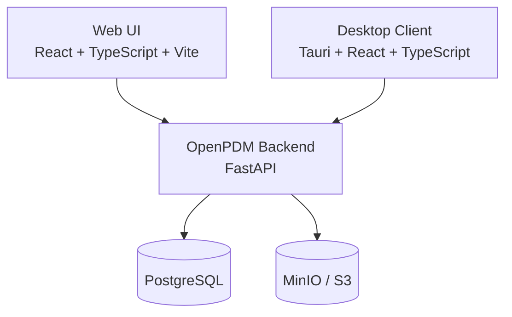

# OpenPDM

OpenPDM is an open-source Engineering Collaboration Platform for organizing,
versioning, relating and securing Engineering Assets.

The repository currently includes a working backend API, a Vite-based web UI,
and a Tauri desktop shell skeleton. The implementation covers:

* local authentication and session management
* administrator-managed Organization and Project membership with role assignment
* generic Assets, immutable Revisions, Representations, and Blobs
* file upload and secure blob download
* generic metadata and PostgreSQL-backed search
* collaboration state, checkout/checkin, notifications and timeline
* generic Asset Graph relationships, references and graph queries
* a read-only plugin registry skeleton

## Quickstart

Required tools:

* Python 3.12+
* uv
* Docker
* Node.js 22+ and pnpm for frontend work
* Rust and the Tauri prerequisites only if you are working on the desktop shell

Install dependencies:

```bash
python scripts/dev.py install
```

Validate the repository:

```bash
python scripts/dev.py validate
python scripts/dev.py lint
python scripts/dev.py test
```

Run the backend API locally:

```bash
python scripts/dev.py run-backend
```

The backend is available at:

* `http://localhost:8000/health`
* `http://localhost:8000/foundation`
* `http://localhost:8000/docs`

Start the local deployment environment with PostgreSQL and MinIO:

```bash
python scripts/dev.py compose-up
```

The compose environment exposes the backend on `http://localhost:18000`.

Start the Compose backend and Web UI together:

```bash
python scripts/start_all.py
```

Run the web UI locally:

```bash
cd frontend
pnpm run dev
```

If the frontend is not served from the same origin as the backend, set
`VITE_API_BASE_URL=http://localhost:8000` before starting Vite.

## Repository Structure

```text
backend/      FastAPI public application API and Platform Core implementation.
frontend/     React, TypeScript and Vite web UI.
desktop/      Tauri desktop client shell.
deployment/   Docker Compose services for local development.
docs/         Project documentation and ADRs.
scripts/      Developer validation and command helpers.
tests/        Repository-level architecture boundary tests.
```

## Architecture



## Authoritative Documentation

Before contributing, read these documents in order:

1. `AGENTS.md`
2. `docs/PROJECT_CHARTER.md`
3. `docs/ARCHITECTURE.md`
4. `docs/VISION.md`
5. `ROADMAP.md`
6. Accepted ADRs in `docs/adr/`

Useful guides:

* `docs/README.md`
* `docs/DEVELOPMENT.md`
* `docs/DEPLOYMENT.md`
* `docs/INTERNAL_FUNCTIONING.md`
* `docs/API_FLOWS.md`
* `docs/API_REFERENCE.md`
* `docs/PHASE_0_DEMO.md`
* `docs/WEB_UI_MANUAL_TEST_GUIDE.md`

Phase 3 Asset Graph implementation guide:

* `docs/PHASE_3_ASSET_GRAPH_QUERY_LIMITS.md`

