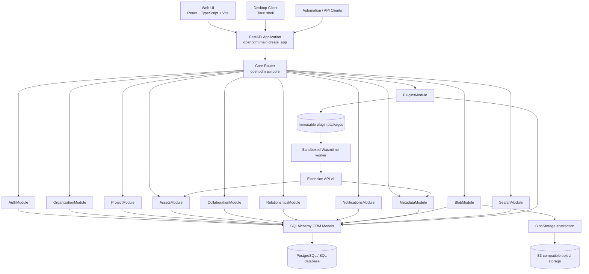
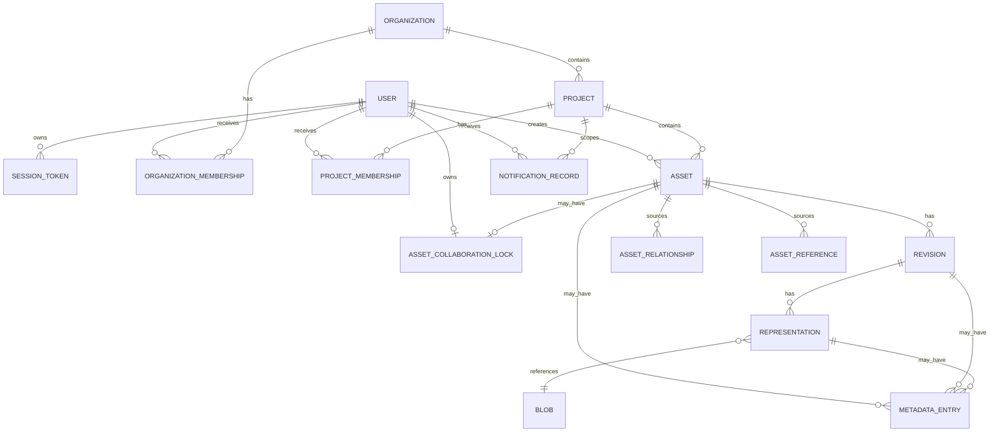
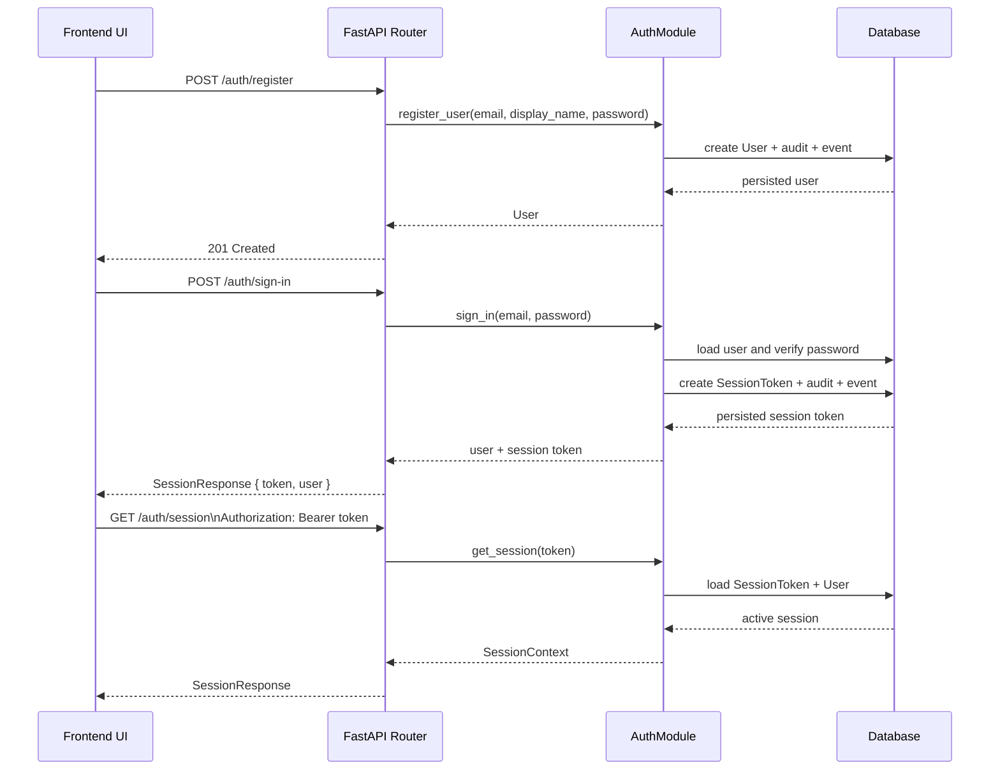
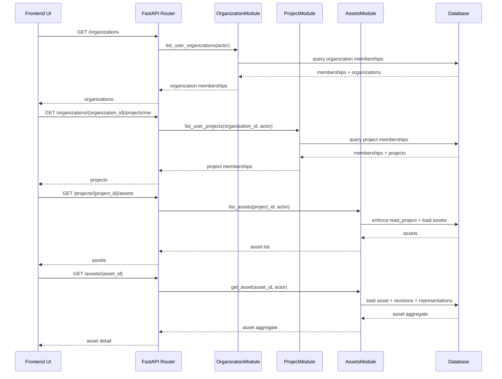
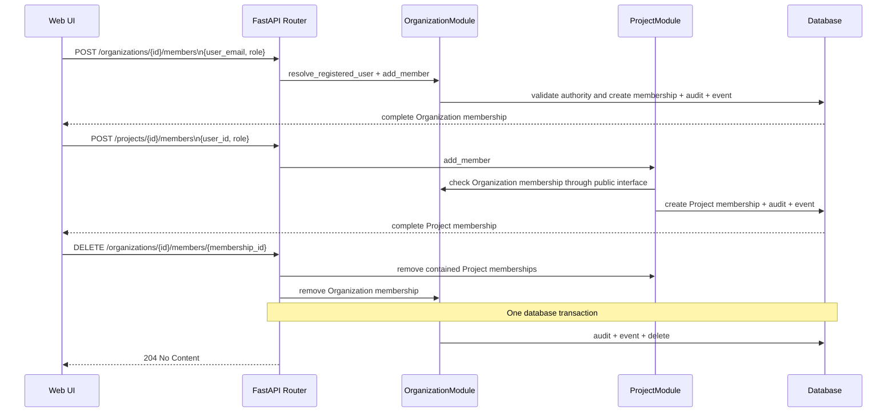
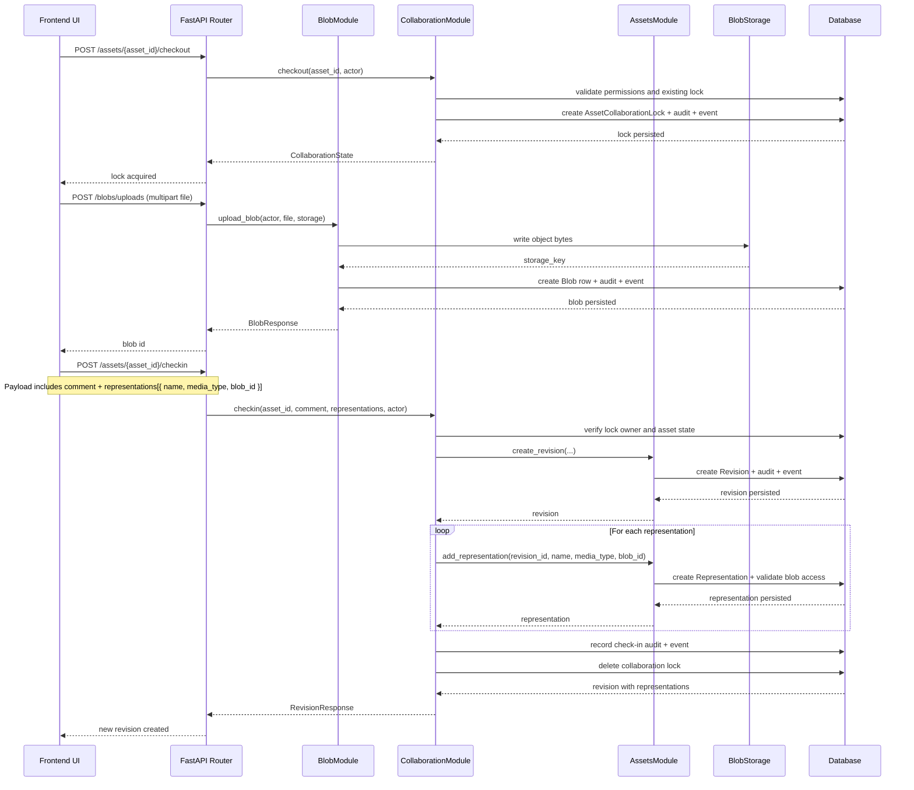
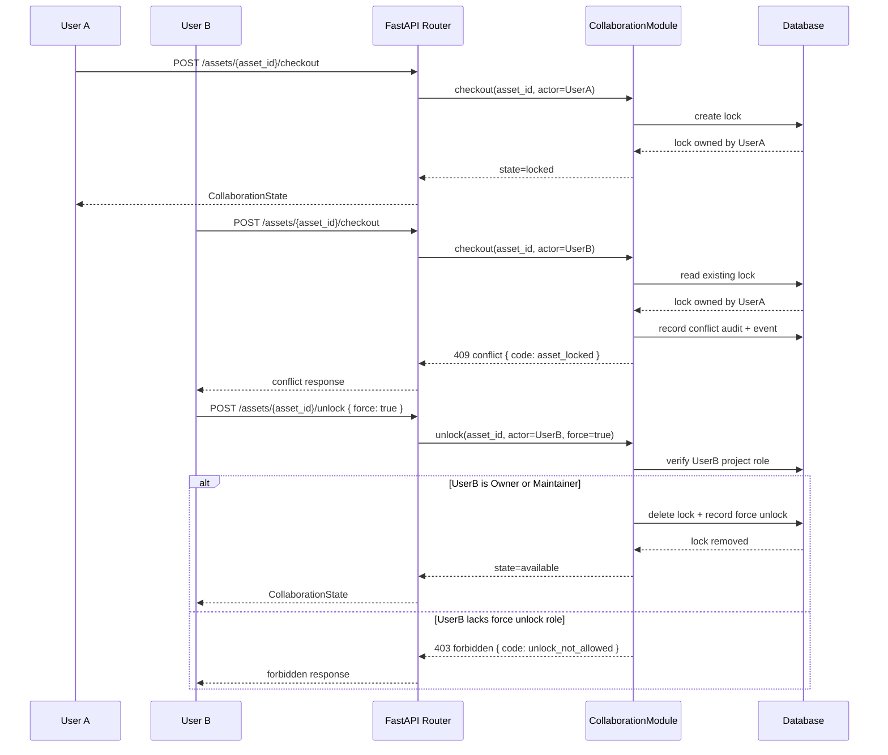

# OpenPDM Mermaid Schematics

This document provides Mermaid schematics grounded in the current repository implementation.

It complements the higher-level target-state material in `docs/ARCHITECTURE.md` and `docs/INTERNAL_FUNCTIONING.md` by focusing on the API surface and request paths implemented in:

* `backend/src/openpdm/main.py`
* `backend/src/openpdm/api/core.py`
* `backend/src/openpdm/platform_core/modules/services.py`
* `backend/src/openpdm/platform_core/modules/models.py`
* `frontend/src/api.ts`

## Runtime Architecture

This view reflects the current application assembly:

* the frontend calls the FastAPI application;
* FastAPI routes dispatch into Platform Module services;
* services persist business data through SQLAlchemy models;
* blob content is coordinated separately through the blob storage abstraction.



## Core Data Model

This entity relationship view maps the primary persisted Platform Core concepts currently modeled in SQLAlchemy.



## Authentication And Session Flow

This sequence shows how the frontend creates and then reuses a bearer-token session.



## Organization To Asset Navigation Flow

This sequence captures the main browse path implemented by the frontend API client.



## Membership Administration API

The public application API exposes an explicit membership lifecycle. New users must already be registered. Organization assignment uses normalized email by default and accepts `user_id` temporarily for compatibility; callers must provide exactly one identifier.

| Operation | Organization endpoint | Project endpoint |
| --- | --- | --- |
| List | `GET /organizations/{organization_id}/members` | `GET /projects/{project_id}/members` |
| Add | `POST /organizations/{organization_id}/members` | `POST /projects/{project_id}/members` |
| Change role | `PATCH /organizations/{organization_id}/members/{membership_id}` | `PATCH /projects/{project_id}/members/{membership_id}` |
| Remove | `DELETE /organizations/{organization_id}/members/{membership_id}` | `DELETE /projects/{project_id}/members/{membership_id}` |

The preferred Organization add payload is:

```json
{
  "user_email": "member@example.com",
  "role": "Contributor"
}
```

Project assignment selects an existing Organization member and may use their stable user identifier:

```json
{
  "user_id": "registered-user-id",
  "role": "Viewer"
}
```

Role changes use `{ "role": "Maintainer" }`. Successful deletion returns `204 No Content`. Membership responses include the membership `id`, `role`, and safe `user` representation.



Owners and Maintainers manage non-Owner members. Only Owners may grant or manage Owner roles, and last-Owner operations return `409 Conflict`. Removing an Organization member atomically removes their contained Project memberships.

## Asset Check-In Flow

This diagram reflects the current collaboration path for uploading file content, checking out an Asset, and creating a new Revision with Representations.



## Collaboration State And Conflict Flow

This sequence focuses on the lock-based collaboration rules currently enforced by the backend.


