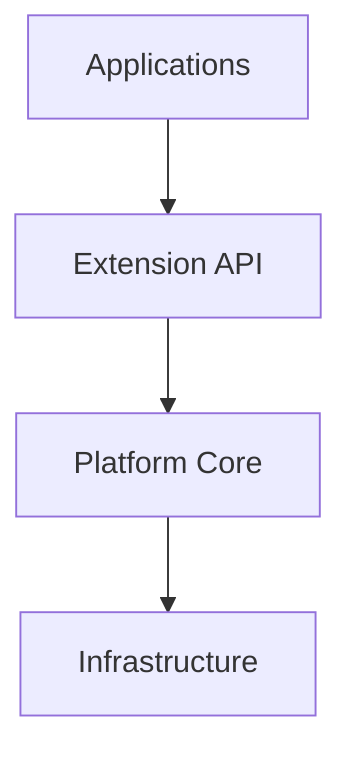
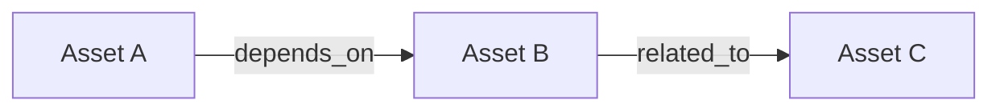
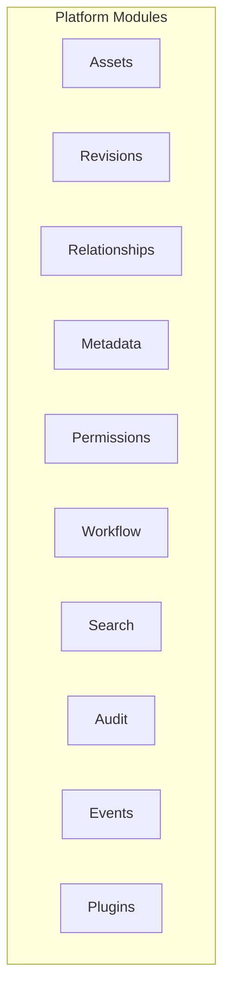

# OpenPDM Architecture

> **Architecture defines responsibilities, boundaries and interactions—not implementations.**

---

# 1. Architectural Vision

OpenPDM is a **modular monolith** built around generic engineering concepts.

The platform provides a stable and domain-agnostic foundation that can be extended through plugins without modifying the Platform Core.

Engineering knowledge is intentionally isolated from the Platform Core.



OpenPDM currently implements the public application API and the early collaboration,
Asset Graph, metadata, search, and plugin registry behaviors described in the
accepted ADRs. The active repository provides a working backend, a browser-based
Web UI, and a desktop shell track, while preserving the platform's generic
core boundaries.

---

# 2. Core Concepts

OpenPDM is built around a small number of generic concepts.

```
Organization
      │
      ▼
Project
      │
      ▼
Asset
      │
      ▼
Revision
      │
      ▼
Representation
      │
      ▼
Blob
```

Each concept has a single responsibility.

| Concept        | Responsibility                                                      |
| -------------- | ------------------------------------------------------------------- |
| Organization   | Groups users and projects.                                          |
| Project        | Owns engineering assets.                                            |
| Asset          | Represents an engineering object independently of its binary files. |
| Revision       | Represents an immutable state of an Asset.                          |
| Representation | Represents a technical view of a Revision.                          |
| Blob           | Binary content stored by the platform.                              |

Engineering concepts (Part, Assembly, PCB, Firmware, etc.) are **not** part of the Platform Core.

---

# 3. Asset Graph

Engineering knowledge is represented as a graph.



Relationships are explicit.

Folders are organizational conveniences.

The Asset Graph is the authoritative representation of engineering knowledge.

---

# 4. Platform Structure

The Platform Core contains generic business capabilities.



Each Platform Module owns a single business responsibility.

Modules communicate only through their public interfaces.

## Current Implementation

The active repository includes a working implementation of the following core
capabilities:

* authentication, user sessions, and session revocation
* administrator-managed Organization and Project membership with role assignment and Owner safeguards
* generic Assets, immutable Revisions, Representations, and Blobs
* file upload, secure download, and blob storage orchestration
* generic metadata attached to assets, revisions, and representations
* PostgreSQL-backed asset search
* collaboration state, checkout/checkin, unlock, notifications, and timeline
* Asset Graph relationships, references, and bounded graph queries
* a read-only plugin registry skeleton for future plugin discovery

---

# 5. Extension Model

Engineering capabilities are implemented outside the Platform Core.

```
                   Extension API

             ▲                     ▲

     Official Plugins      Community Plugins
```

Plugins may provide capabilities such as:

* Engineering file parsing
* Metadata extraction
* Dependency discovery
* BOM extraction
* Preview generation
* Validation
* Import / Export

The Platform Core never understands engineering file formats.

---

# 6. Module Interaction

Platform Modules communicate only through public contracts.

```
Workflow Module
        │
        ▼
 Asset Module Interface
```

Never:

```
Workflow Module
        │
        ▼
 Asset Module Internals
```

The same public interfaces are used by Platform Modules.

No internal shortcut is permitted.

---

# 7. Architectural Rules

The following rules govern the entire platform.

### Platform Core

* Owns the generic business model.
* Never understands engineering domains.
* Never parses engineering file formats.

### Platform Modules

* Have a single responsibility.
* Communicate only through public interfaces.
* Must not access another module's internals.

### Extension API

* Is the only supported extension mechanism. Plugins must not directly depend on Public Module Interfaces.
* Is stable and versioned.
* Is equally available to Official Plugins and Community Plugins.

### Official Plugins

* Follow the same rules as any third-party plugin.
* Do not receive privileged access.
* Serve as reference implementations of the Extension API.

### Community Plugins

* Extend the platform without modifying the Platform Core.
* Depend only on the Extension API.

---

# 8. Evolution Principles

The architecture evolves according to the following principles:

* Build the Platform Core before specialization.
* Prefer new plugins over new Platform Modules whenever possible.
* Preserve module boundaries.
* Prefer composition over coupling.
* Keep infrastructure replaceable.
* Preserve backward compatibility whenever practical.
* Record architectural decisions through ADRs.

---

# 9. Architecture Ownership

This document intentionally describes only the stable architecture of OpenPDM.

Implementation details, technologies and design decisions are documented separately through Architecture Decision Records (ADRs).

The architecture should evolve slowly.

The implementation may evolve continuously.
