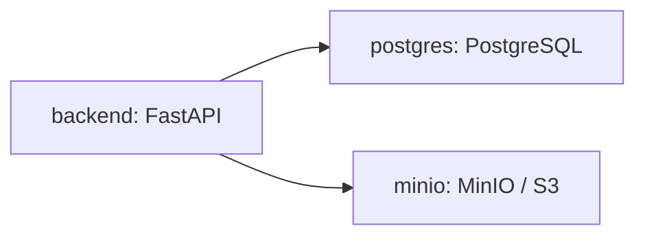

# OpenPDM Deployment

This guide describes the local deployment used to run the current OpenPDM core
platform implementation, including the FastAPI API, PostgreSQL, MinIO object
storage, and the web UI development workflow.

This deployment is intended for local development and demonstration. It is not a
production hardening guide.

## Services

The local deployment uses Docker Compose:

* `backend`: FastAPI backend serving the current core platform API.
* `postgres`: PostgreSQL 18 primary database.
* `minio`: MinIO S3-compatible blob storage.

The compose file configures PostgreSQL and MinIO as infrastructure dependencies,
while the backend remains responsible for application logic and public API
behavior.



## Start the Environment

```bash
python scripts/dev.py compose-up
```

Equivalent Docker command:

```bash
docker compose --env-file .env.example -f deployment/compose.yaml up --build
```

## Endpoints

After startup:

* Backend API: `http://localhost:18000`
* Health check: `http://localhost:18000/health`
* OpenAPI documentation: `http://localhost:18000/docs`
* PostgreSQL: `localhost:5432`
* MinIO API: `http://localhost:9000`
* MinIO console: `http://localhost:9001`

The backend now exposes a concrete API surface for:

* authentication and sessions (`/auth/*`)
* organizations and projects (`/organizations`, `/projects`)
* assets, revisions and collaboration (`/assets/*`, `/notifications`)
* blob upload and download (`/blobs/*`)
* metadata, search and plugin registration (`/metadata`, `/search/assets`, `/plugins`)

## Local Backend-only Development

If you only need the backend during development, run:

```bash
python scripts/dev.py run-backend
```

That starts the API on `http://localhost:8000`.

## Web UI Development

The frontend can be started separately with:

```bash
cd frontend
pnpm run dev
```

If the UI is not served from the same origin as the backend, set
`VITE_API_BASE_URL=http://localhost:8000` before starting Vite.

## Limitations

This deployment remains focused on local development and does not yet cover:

* production secrets management;
* TLS termination;
* backup and restore procedures;
* full production observability and hardening;
* plugin execution outside the current registry and state model.
