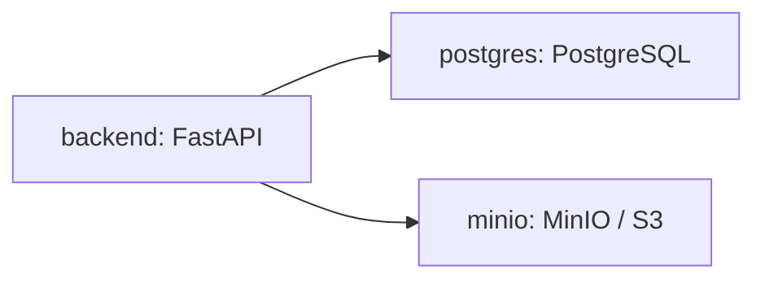

# OpenPDM Deployment

This guide describes the local deployment used to run the current OpenPDM core
platform implementation, including the FastAPI API, PostgreSQL, MinIO object
storage, and the web UI development workflow.

This deployment is intended for local development and demonstration. It is not a
production hardening guide.

## Services

The local deployment uses Docker Compose:

* `backend`: FastAPI backend serving the public application API and Platform Core.
* `postgres`: PostgreSQL 18 primary database.
* `minio`: MinIO S3-compatible blob storage.

The compose file configures PostgreSQL and MinIO as infrastructure dependencies,
while the backend remains responsible for application logic and public API
behavior.

The `plugin-packages` volume preserves validated immutable plugin packages across
backend image rebuilds and container replacement. PostgreSQL stores lifecycle
records, but it is not a substitute for package storage; both must be retained.



## Start the Environment

```bash
python scripts/dev.py compose-up
```

Equivalent Docker command:

```bash
docker compose --env-file .env.example -f deployment/compose.yaml up --build
```

## Endpoints

After startup:

* Backend API: `http://localhost:18000`
* Health check: `http://localhost:18000/health`
* OpenAPI documentation: `http://localhost:18000/docs`
* PostgreSQL: `localhost:5432`
* MinIO API: `http://localhost:9000`
* MinIO console: `http://localhost:9001`

The backend now exposes a concrete API surface for:

* authentication and sessions (`/auth/*`)
* Organizations, Projects, membership and role administration (`/organizations`, `/projects`)
* Assets, Revisions, collaboration and notifications (`/assets/*`, `/notifications`)
* paged operational collections and private saved Engineering Asset views (`*/page`, `/users/me/project-views`)
* legacy multipart and bounded resumable Blob transfer (`/blobs/*`)
* relationships, references and bounded graph queries (`/relationships`, `/references`, `/assets/*/graph`)
* metadata, search and the governed Plugin Platform (`/metadata`, `/search/assets`, `/plugins`)

## Asset Graph Audit Configuration

Relationship and Reference mutations, failures, and permission denials are always
audited. Successful graph reads are not audited by default. Set
`OPENPDM_AUDIT_GRAPH_QUERIES=true` to persist `GraphQueryExecuted` audit records
and domain events for successful graph queries. Security-sensitive denied reads
remain audited regardless of this setting.

## Resumable Blob Upload Limits

The Blobs Platform Module owns resumable upload-session validation, progress,
completion, expiry, and cleanup. Storage adapters keep their provider-private
temporary object layout behind the BlobStorage interface.

| Environment variable | Default | Meaning |
| --- | --- | --- |
| `OPENPDM_BLOB_UPLOAD_CHUNK_SIZE_BYTES` | `5242880` | Required non-final chunk size; must be greater than zero. |
| `OPENPDM_BLOB_UPLOAD_MAX_SIZE_BYTES` | `5368709120` | Maximum total upload-session size; must be greater than zero. |
| `OPENPDM_BLOB_UPLOAD_SESSION_TTL_SECONDS` | `86400` | Active-session lifetime before cleanup and expiry; must be greater than zero. |

No Blob record is created until every chunk is present and the assembled content
matches the declared size and optional SHA-256 digest.

Upload sessions are bound to an Engineering Asset. Every operation checks the
session owner and current Project permission again, so membership revocation
takes effect during an in-progress transfer. Creating a session also performs
bounded cleanup passes (up to 25 expired sessions and 25 completed sessions
whose provider cleanup is pending), providing a production caller without adding
a scheduler. Remaining candidates are handled by later session creation
requests. Internal cleanup retries do not depend on the original user's current
membership because they only remove provider-private temporary chunks.

After completion commits the Blob, the backend deletes provider-private chunks.
A provider cleanup failure is recorded as
`blob.upload_session.cleanup_failed`, leaves the session marked for cleanup, and
does not invalidate the committed Blob or change completion idempotency. A
repeated completion request retries that cleanup. Provider object keys and
cleanup diagnostics are never returned in public Blob responses.

## Local Backend-only Development

If you only need the backend during development, run:

```bash
python scripts/dev.py run-backend
```

That starts the API on `http://localhost:8000`.

## Web UI Development

The frontend can be started separately with:

```bash
cd frontend
pnpm run dev
```

If the UI is not served from the same origin as the backend, set
`VITE_API_BASE_URL=http://localhost:8000` before starting Vite.

To start the Compose backend and frontend development server together, run `python scripts/start_all.py` from the repository root.

## Configuration Notes

`.env.example` contains development defaults for PostgreSQL, MinIO, the exposed backend port, graph-query auditing and the plugin sandbox. Backend settings use the `OPENPDM_` prefix. The checked-in credentials are local defaults and must not be reused for a production deployment.

Generate `OPENPDM_PLUGIN_CONFIGURATION_KEY` before storing plugin secrets:

```bash
python -c "from cryptography.fernet import Fernet; print(Fernet.generate_key().decode())"
```

Protect and back up this key outside the database. Losing it makes encrypted plugin configuration unreadable. Set `OPENPDM_PLUGIN_PACKAGE_ROOT` to persistent storage owned only by the backend process. Sandbox fuel, memory and timeout settings are bounded by application validation and should be reduced only after testing installed plugins.

Operational collection routes default to 50 results and enforce a maximum of 100. Their cursors are opaque and are invalid after changing resource scope, actor scope, filters, sort key or direction.

The Compose backend runs Alembic migrations before starting the API. Migration `20260718_0005` creates the owner-private `project_asset_views` table. Existing local-development databases created before Alembic tracking are reconciled idempotently and stamped through the current migration head.

For a backend started outside Compose, upgrade the database before starting the new application version:

```bash
uv run alembic upgrade head
```

## Limitations

This deployment remains focused on local development and does not yet cover:

* production secrets management;
* TLS termination;
* backup and restore procedures;
* full production observability and hardening;
* remote plugin registries and unattended package upgrades;
* publisher-signature verification;
* tenant-scoped plugin instances or configuration;
* hostile-code isolation beyond the accepted WebAssembly sandbox and deployment hardening model.
