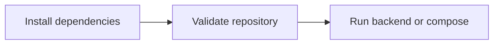

# OpenPDM Development

This document describes the current local development workflow for the backend
API, the Vite web UI, and the local Docker Compose environment.

The authoritative architecture remains:

* `docs/PROJECT_CHARTER.md`
* `docs/ARCHITECTURE.md`
* accepted ADRs in `docs/adr/`

## Required Tools

Use these versions or newer compatible versions:

* Python 3.12+
* uv
* Docker
* Node.js 22+ and pnpm for Web UI work
* Rust and Tauri 2 prerequisites only if you are explicitly working on the
  desktop shell track

## Install Dependencies

```bash
python scripts/dev.py install
```

This installs Python dependencies with uv. If pnpm is available, it also installs
frontend and desktop JavaScript dependencies.



## Validate Locally

```bash
python scripts/dev.py validate
python scripts/dev.py lint
python scripts/dev.py test
```

Validation includes:

* repository structure and project configuration checks;
* Ruff formatting and lint checks;
* pytest backend and architecture tests;
* frontend TypeScript and Vitest checks when JavaScript dependencies are installed.

Build the Web UI production bundle after changing frontend behavior:

```bash
cd frontend
pnpm run build
```

## Run the Backend

```bash
python scripts/dev.py run-backend
```

The backend API is available at:

* `http://localhost:8000/health`
* `http://localhost:8000/foundation`
* `http://localhost:8000/docs`

The current implementation includes public endpoints for:

* authentication (`/auth/*`)
* Organizations, Projects, membership and role administration (`/organizations`, `/projects`)
* Assets, Revisions, collaboration and notifications (`/assets/*`, `/notifications`)
* blob upload and download (`/blobs/*`)
* relationships, references and bounded graph queries (`/relationships`, `/references`, `/assets/*/graph`)
* metadata, search and the governed Plugin Platform (`/metadata`, `/search/assets`, `/plugins`)

The OpenAPI documentation is available at `http://localhost:8000/docs` when the
backend is running.

## Run the Web UI

```bash
cd frontend
pnpm run dev
```

The Vite app is an API consumer and should use the public application API rather
than any internal module interfaces. If you run the frontend on a different host
or port, set `VITE_API_BASE_URL=http://localhost:8000` before starting Vite.

## Run the Local Deployment Environment

```bash
python scripts/dev.py compose-up
```

The compose stack provides:

* the FastAPI backend on `http://localhost:18000`
* PostgreSQL on `localhost:5432`
* MinIO on `http://localhost:9000` and `http://localhost:9001`

## Run the Desktop Client

```bash
cd desktop
pnpm run dev
```

The desktop shell remains a separate track and is not required for the core
backend and web UI workflow.

## Start Backend And Web UI Together

```bash
python scripts/start_all.py
```

This starts the Compose backend on `http://localhost:18000`, waits for its health check and starts the Vite Web UI on `http://localhost:5173`. Use `--skip-compose`, `--skip-frontend` or `--dry-run` for focused workflows.

## Runtime Configuration

Backend environment variables use the `OPENPDM_` prefix. The common development settings are documented in `.env.example`; they cover database and S3 connections, plugin package storage, sandbox limits, plugin configuration encryption, the backend host port and optional successful graph-query auditing. Cross-origin browser access defaults to the local Vite development and preview origins and can be overridden with `OPENPDM_API_CORS_ORIGINS`.

## Develop A Plugin

The normative WIT contract is packaged at `openpdm.extension_api/wit/openpdm-extension.wit`. Build the domain-neutral Official Plugin with:

```bash
uv run python scripts/build_reference_plugin.py
```

The generated `.openpdm-plugin` archive is written under `plugins/reference/dist/`. See [Plugin Development](PLUGIN_DEVELOPMENT.md) for the package, SDK and invocation workflow.

## Architecture Boundaries

The implementation already exercises the Platform Core boundaries in a concrete
way.

Rules:

* Platform Modules expose public interfaces.
* Platform Modules do not access another module's internals.
* Plugins depend on the Extension API, not public module interfaces.
* Infrastructure adapters remain replaceable.
* Engineering-domain knowledge belongs to plugins, not the Platform Core.

