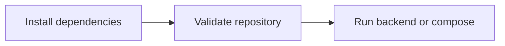

# OpenPDM Development

This document describes the current local development workflow for the backend
API, the Vite web UI, and the local Docker Compose environment.

The authoritative architecture remains:

* `docs/PROJECT_CHARTER.md`
* `docs/ARCHITECTURE.md`
* accepted ADRs in `docs/adr/`

## Required Tools

Use these versions or newer compatible versions:

* Python 3.12+
* uv
* Docker
* Node.js 22+ and pnpm for Web UI work
* Rust and Tauri 2 prerequisites only if you are explicitly working on the
  desktop shell track

## Install Dependencies

```bash
python scripts/dev.py install
```

This installs Python dependencies with uv. If pnpm is available, it also installs
frontend and desktop JavaScript dependencies.


```mermaid
flowchart LR
    Install[Install dependencies]
    Validate[Validate repository]
    Run[Run backend or compose]

    Install --> Validate
    Validate --> Run
```

## Validate Locally

```bash
python scripts/dev.py validate
python scripts/dev.py lint
python scripts/dev.py test
```

Validation includes:

* repository structure and project configuration checks;
* Ruff formatting and lint checks;
* pytest backend and architecture tests;
* frontend TypeScript and Vitest checks when JavaScript dependencies are installed.

For the complete usable prototype acceptance gate, including browser checks and
known limits, see [Usable Prototype Acceptance](PROTOTYPE_ACCEPTANCE.md).

Build the Web UI production bundle after changing frontend behavior:

```bash
cd frontend
pnpm run build
```

## Run the Backend

```bash
python scripts/dev.py run-backend
```

The backend API is available at:

* `http://localhost:8000/health`
* `http://localhost:8000/foundation`
* `http://localhost:8000/docs`

The current implementation includes public endpoints for:

* authentication (`/auth/*`)
* Organizations, Projects, membership and role administration (`/organizations`, `/projects`)
* Assets, Revisions, collaboration and notifications (`/assets/*`, `/notifications`)
* blob upload and download (`/blobs/*`)
* relationships, references and bounded graph queries (`/relationships`, `/references`, `/assets/*/graph`)
* metadata, search and the governed Plugin Platform (`/metadata`, `/search/assets`, `/plugins`)

The OpenAPI documentation is available at `http://localhost:8000/docs` when the
backend is running.

## Run the Web UI

```bash
cd frontend
pnpm run dev
```

The Vite app is an API consumer and should use the public application API rather
than any internal module interfaces. Its development proxy defaults to
`http://localhost:18000`, matching the Docker Compose host port. To use another
API endpoint, set `VITE_API_BASE_URL`; to run the backend directly through the
local command on port `8000`, set `VITE_API_PROXY_TARGET=http://localhost:8000`
before starting Vite.

The Web UI uses React Router for durable Home, Project and Plugin Administration
URLs, Lucide for interface icons, and repository-owned CSS design tokens for its
dark responsive workspace shell. Do not display fabricated data for capabilities
that are not available through the public application API.

The Web UI operational stack is documented by ADR-0044. New Web UI work should
prefer the existing React Router route model, Radix interaction primitives,
Lucide icons, Vitest unit/component tests, Playwright browser checks, and
repository-owned CSS tokens before introducing another UI dependency or pattern.

### Resumable Transfer Recovery

The Web UI stores minimal resumable upload recovery state in browser
`sessionStorage`, scoped by user and Engineering Asset. The stored state contains
upload-session identity and selected-file identity, not file bytes, storage keys
or credentials. On reuse, the Web UI revalidates the session through the public
upload-session API before sending more chunks.

## Run the Local Deployment Environment

```bash
python scripts/dev.py compose-up
```

The compose stack provides:

* the FastAPI backend on `http://localhost:18000`
* PostgreSQL on `localhost:5432`
* MinIO on `http://localhost:9000` and `http://localhost:9001`

## Run the Desktop Client

```bash
cd desktop
pnpm run dev
```

The desktop shell remains a separate track and is not required for the core
backend and web UI workflow.

## Start Backend And Web UI Together

```bash
python scripts/dev.py install
python scripts/start_all.py
```

This is the documented local startup path for the usable prototype. It starts
PostgreSQL, MinIO and the backend through Docker Compose, waits for the backend
health check, and then starts the Vite Web UI on its public local port.

Readiness checks after startup:

* Backend health: `http://localhost:18000/health`
* Foundation API: `http://localhost:18000/foundation`
* API docs: `http://localhost:18000/docs`
* Web UI: `http://localhost:5173`

Use `--skip-compose`, `--skip-frontend` or `--dry-run` for focused workflows.
If the direct backend command is used instead of Compose, confirm
`http://127.0.0.1:8000/health`, `http://127.0.0.1:8000/foundation` and set
`VITE_API_PROXY_TARGET=http://localhost:8000` before starting Vite.

Startup failure notes:

* missing Docker prevents PostgreSQL, MinIO and the Compose backend from starting;
* missing uv prevents Python dependency installation and backend development commands;
* missing Node.js, pnpm or npm prevents the Vite Web UI from starting.

### Seed The Default Official Plugins

`start_all.py` only starts the stack; it never installs plugins on its own,
since plugin installation and activation are Platform-Administrator-only
operations (ADR-0035, ADR-0037). To have the default set of Official Plugins
installed and enabled, run this once against a running backend:

```bash
uv run python scripts/seed_official_plugins.py
```

It registers (or signs back into) a seed local account, which ADR-0035
promotes to Platform Administrator automatically as the first user of an
empty deployment, then installs and enables each plugin listed in that
script's `DEFAULT_PLUGINS` (currently just the reference plugin) through the
same public API a human would use from the Plugin Administration screen. The
seed account's credentials can be overridden with `OPENPDM_SEED_ADMIN_EMAIL`,
`OPENPDM_SEED_ADMIN_PASSWORD` and `OPENPDM_SEED_ADMIN_DISPLAY_NAME` (see
`.env.example`). Safe to re-run; it skips plugins that are already installed.

To grant Platform Administrator authority to another account (e.g. an
Organization Owner who should also administer plugins — Organization and
Project roles grant no plugin-administration authority on their own, per
ADR-0035), sign in as an existing Platform Administrator and use the
"Platform Administrators" panel at the top of the Plugin Administration
screen (`/administration/plugins`): it lists current Platform
Administrators with a Revoke action, and a "Grant by email" form for
registered users. Revoking is blocked if it would leave the deployment with
zero active Platform Administrators.

## Runtime Configuration

Backend environment variables use the `OPENPDM_` prefix. The common development settings are documented in `.env.example`; they cover database and S3 connections, plugin package storage, sandbox limits, plugin configuration encryption, the backend host port and optional successful graph-query auditing. Cross-origin browser access defaults to the local Vite development and preview origins and can be overridden with `OPENPDM_API_CORS_ORIGINS`.

## Develop A Plugin

The normative WIT contract is packaged at `openpdm.extension_api/wit/openpdm-extension.wit`. Build the domain-neutral Official Plugin with:

```bash
uv run python scripts/build_reference_plugin.py
```

The generated `.openpdm-plugin` archive is written under `plugins/reference/dist/`. See [Plugin Development](PLUGIN_DEVELOPMENT.md) for the package, SDK and invocation workflow.

## Architecture Boundaries

The implementation already exercises the Platform Core boundaries in a concrete
way.

Rules:

* Platform Modules expose public interfaces.
* Platform Modules do not access another module's internals.
* Plugins depend on the Extension API, not public module interfaces.
* Infrastructure adapters remain replaceable.
* Engineering-domain knowledge belongs to plugins, not the Platform Core.

