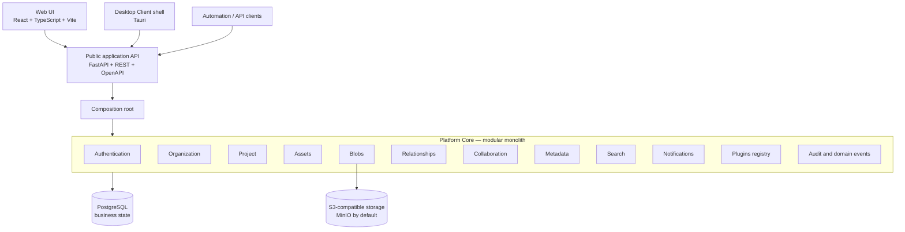
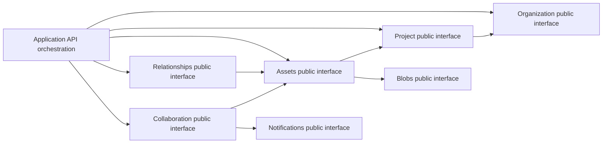
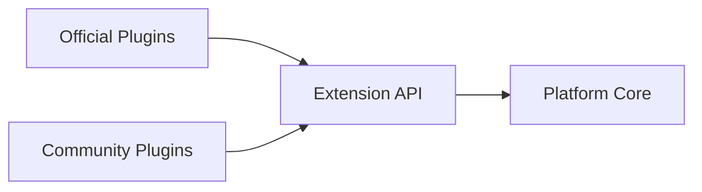

# OpenPDM Internal Functioning

This document explains the implemented Platform Core and its primary runtime boundaries. Stable architectural direction remains defined by the Project Charter, Architecture document and accepted ADRs.

## Runtime Layers

Client applications consume only the public application API. The composition root binds Platform Module facades to their current implementations. Platform business state is stored in PostgreSQL; Blob bytes are coordinated separately through replaceable S3-compatible storage.

## Implemented Platform Module Responsibilities

| Capability | Responsibility |
| --- | --- |
| Authentication | Local users, opaque server-side sessions, sign-in, sign-out and revocation |
| Organization | Organization identity, membership and Organization roles |
| Project | Projects, Project roles and Project-scoped permission checks |
| Assets | Engineering Assets, immutable Revisions, Representations and generic lifecycle status |
| Blobs | Blob records, upload/download orchestration and storage abstraction |
| Relationships | Asset relationships, references and bounded graph queries |
| Collaboration | Checkout, locks, check-in, conflict recovery and timeline |
| Metadata | Generic key/value metadata without engineering semantics |
| Search | PostgreSQL-backed Engineering Asset search |
| Notifications | Project-scoped in-app collaboration notifications and acknowledgment |
| Plugins | Read-only plugin registry and discovery skeleton |
| Audit and events | Traceable business mutations and domain-event emission |

## Key Dependency Paths

The Project Platform Module may check Organization membership through the Organization public interface. Organization membership removal is coordinated by the application layer: contained Project memberships are removed before the Organization membership in one transaction, without creating a reverse Organization-to-Project dependency.

## Authorization And Membership

Authorization is calculated by the Platform Core. A user must belong to an Organization before receiving a Project role. Project permissions use `Owner`, `Maintainer`, `Contributor` and `Viewer` roles.

Membership administration is exposed through the public application API and Web UI:

* Owners and Maintainers manage non-Owner members;
* only Owners manage Owner roles;
* every Organization and Project retains at least one Owner;
* Organization removal also revokes contained Project memberships;
* membership mutations produce audit records and domain events.

ADR-0033 records this accepted membership lifecycle and its authorization boundaries.

## Extension Boundary

Official Plugins and Community Plugins use the same Extension API. The current plugin capability is a registry skeleton; plugin execution and privileged internal access are not implemented.

## Architectural Invariants

* The Platform Core remains domain-agnostic.
* Engineering knowledge belongs to plugins.
* Platform Modules interact through public interfaces.
* Clients do not call Platform Module internals.
* Plugins do not bypass the Extension API or Platform Core authorization.
* Infrastructure adapters remain replaceable.
