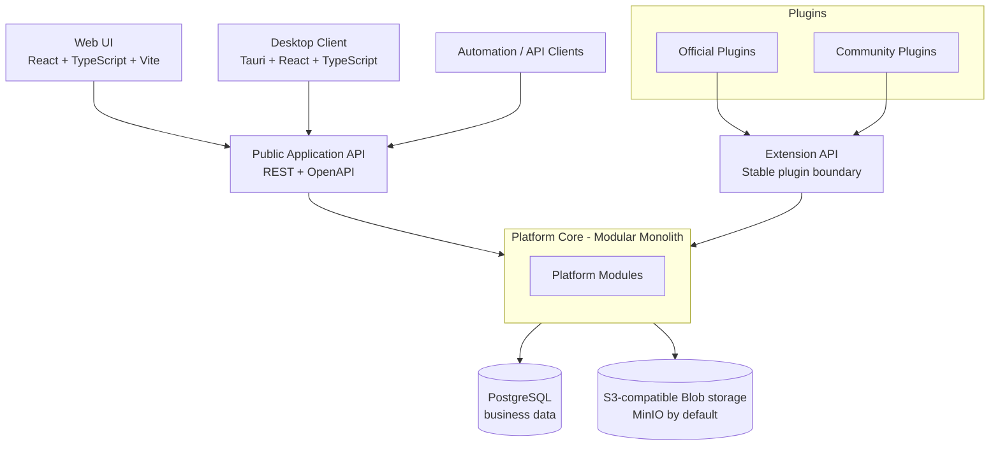
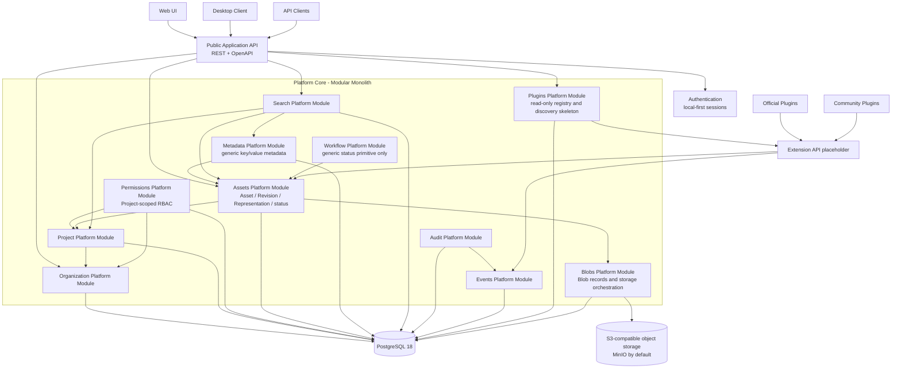

# OpenPDM Internal Functioning

This document provides a visual explanation of how OpenPDM is intended to function internally based on the current authoritative documentation and accepted ADRs.

It is a **reference view of the target Platform Core architecture**, especially for the Phase 1 MVP boundaries. The repository is currently in **Phase 0 - Foundation**, so some capabilities shown here are architectural targets rather than already implemented runtime behavior.

## General Overview

This overview shows the main architectural layers:

* client applications consume the public application API;
* the Platform Core is implemented as a modular monolith;
* Platform Modules communicate only through public interfaces;
* plugins extend OpenPDM through the Extension API only;
* business data and Blob content are stored separately.

## Detailed Diagram

This detailed view shows the Phase 1 Platform Module boundaries and the main interaction paths defined by the architecture and ADRs.

## Reading Notes

* The Platform Core remains domain-agnostic: it manages generic Engineering Asset lifecycle concepts, not CAD or EDA semantics.
* Engineering knowledge belongs to plugins and must cross the Extension API boundary rather than using Platform Module internals.
* The Assets Platform Module owns lifecycle behavior, while the Blobs Platform Module owns binary storage coordination.
* Authorization is decided by the Platform Core, not by plugins or client applications.
* Search remains generic in Phase 1 and is limited to PostgreSQL-backed search over Platform Core data.
* The Phase 1 plugin registry is intentionally read-only until OpenPDM defines a dedicated platform administration model in a later phase.
