# Plugin Security And Troubleshooting

Plugin packages and all plugin output are untrusted input. The supported runtime never loads native libraries, Python wheels, scripts or arbitrary host executables from a package.

## Security Boundary

```mermaid
flowchart LR
    Package["Untrusted plugin package"] --> Validate["Archive, manifest and digest validation"]
    Validate --> Store["Immutable package storage"]
    Store --> Worker["Separate Wasmtime worker"]
    Worker --> Sandbox["Fresh Store; no WASI; bounded resources"]
    Sandbox --> Response["Schema-validated response"]
    Response --> Authorize["Platform Core reauthorization"]
    Authorize --> Modules["Owning Platform Module public interfaces"]
```

Every invocation uses a fresh Wasmtime Store with bounded fuel, memory, tables, instances, request size, response size and wall-clock duration. The linker exposes no WASI filesystem, network, process, environment, clock or random capabilities. Unknown imports fail activation.

The separate worker protects Platform Core memory from ordinary guest failures. Wasmtime and `componentize-py` remain security-sensitive dependencies and must be updated deliberately. The sandbox does not replace operating-system hardening or guarantee the absence of runtime vulnerabilities.

## Administration And Secrets

Only Platform Administrators may install, configure, enable or disable plugins. Organization and Project roles do not grant deployment authority. OpenPDM prevents removal of the last active Platform Administrator.

Secret configuration fields are encrypted with `OPENPDM_PLUGIN_CONFIGURATION_KEY`. APIs return only public values and names of configured secret fields. Secret values are excluded from audit records, events and diagnostics.

## Failure Diagnosis

Inspect `GET /plugins/{plugin_id}`:

* `incompatible`: the manifest does not support Extension API v1;
* `failed` with a fuel diagnostic: increase the bounded fuel setting only after reviewing the component;
* `failed` with an import diagnostic: the component requests an unsupported host capability;
* package-integrity failure: restore the originally approved immutable package or reinstall it;
* configuration decryption failure: restore the deployment key; do not overwrite encrypted values blindly.

Inspect `GET /plugins/{plugin_id}/event-deliveries` for attempt counts and sanitized errors. A failed event does not roll back the originating Platform Core transaction. Delivery is at least once, so duplicate handling is a plugin responsibility.

## Incident Response

Disable a suspicious plugin immediately, preserve its package digest and audit records, rotate any configuration secret it could access, and update Wasmtime if the incident involves a sandbox vulnerability. Do not replace the package file in place; use the authenticated upgrade route for a reviewed same-identity package. Upgrades disable the plugin and clear configuration so it must be explicitly reconfigured and enabled. Removal requires a disabled plugin and retains immutable package evidence.
